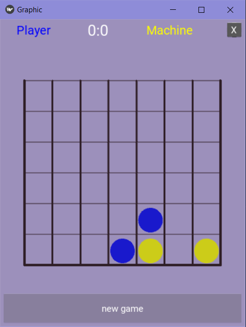

### Game 4 in row 
in [Connect_4 (SA2C version)](Connect_4.ipynb) you can train model in self play mode  
or [maddpg 4InRow CNN (MADDPG version)](maddpg_4InRow_CNN.ipynb)
>with graphics and Convolutaonal newral network and Reinforcement learning MADDPG model

    run 4anim.py in command line to play (python 4anim.py)

