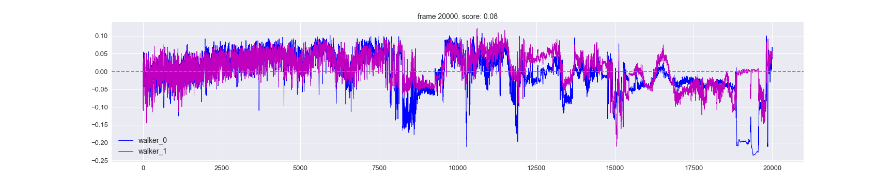
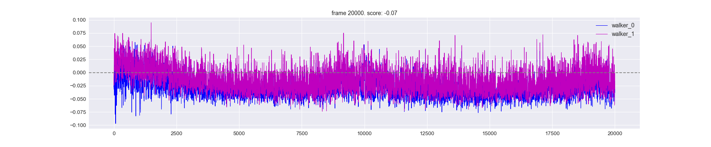

### MultiWalker 
[maddpg walker 1.1 deeper](maddpg walker 1.1 deeper.ipynb) - Jupyter code  
[SoloWalker training project](https://github.com/Otnielush/MAS-Machon-Lev/tree/master/SA2C%20RNN%20Walker)

-----
## Training results:

